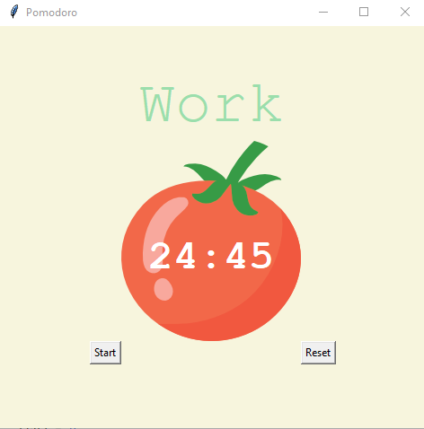
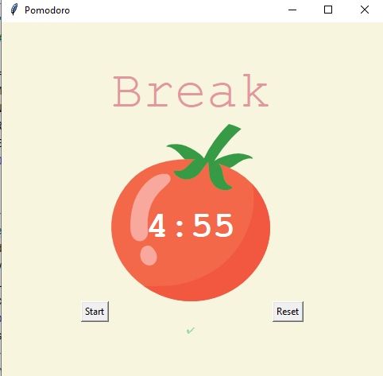
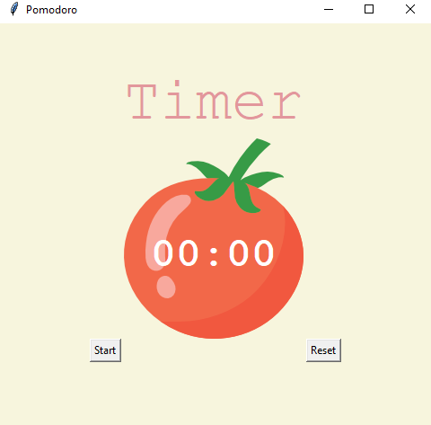

# Pomodoro 🍅 GUI Application using Tkinter

🍅 After run the application coutdown starts from 25 minutes.

 

 

 

🍅 When work period will end it will show the user to take 5 minutes break time. And also check marks ✔️ also displyed so that user can tracking their activity.

 

 

 

🍅 If user click the reset button Timer UI will be shown.

 

 
